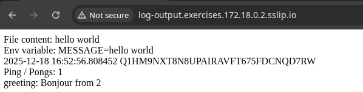
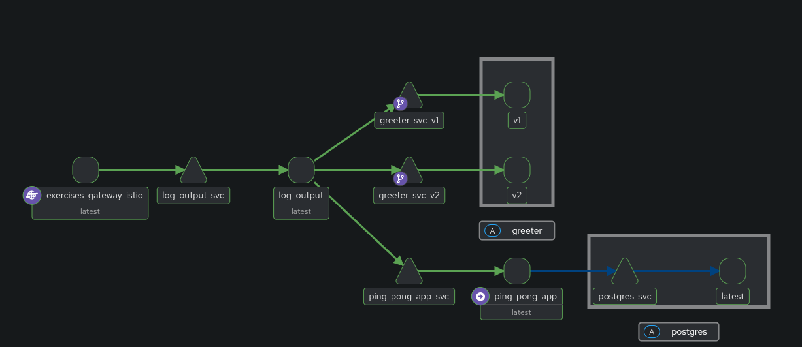

## exc 5.7

Patched knative to enable multi container clusters as it does not support sidecars

also patched it to enable fsgroup support to help with shared volume

## exc 5.3

- the greeter-v* files are deployment and service for the 2 seperate versions of greeters
- virtualservice.yaml will route the traffice from greeter-service to the individual nodes
- greeter-frontdoor creates the greeter-service domain

The *-gcp files are gcp related gateway and httproutes

*-k3s files are the config for running only 1 version of greeter

## Older content

https://github.com/skinatro/kmoocfi-exercises

docker build -f Dockerfile.gen -t skinatro/log-output-gen .
docker build -f Dockerfile.read -t skinatro/log-output-read .
docker push skinatro/log-output-gen
docker push skinatro/log-output-read

k3d cluster create -p 8080:30080@agent:0 -p 5000:80@loadbalancer --agents 2

gcloud container clusters create dwk-cluster --zone=europe-north1-b --cluster-version=1.32 --disk-size=32 --num-nodes=3 --machine-type=e2-medium

gcloud container clusters update clustername --location=europe-north1-b --gateway-api=standard