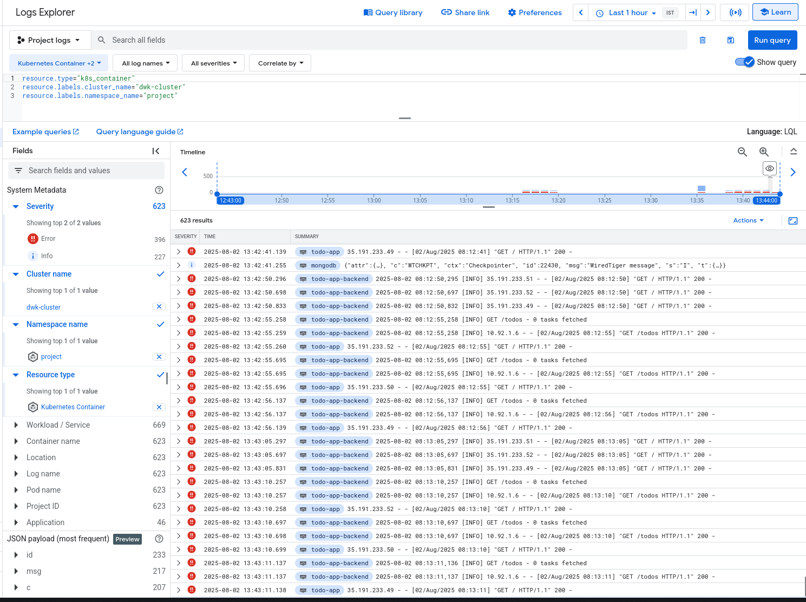

https://github.com/skinatro/kmoocfi-project
https://github.com/skinatro/kmoocfi-project-config

# DBaaS vs DIY

Database -> **MongoDB**

| Comparison           | DBaaS (Mongo Atlas)                              | DIY / Self-hosted                               |
|----------------------|--------------------------------------------------|-------------------------------------------------|
| Self Hosting Effort  | None, managed by provider                        | You provision & maintain all infra yourself     |
| Backups              | Fully automated, managed, and monitored          | Set up & manage backups and restores manually   |
| Scaling              | Effortless – just click or API                   | Must resize hardware/VMs and cluster nodes      |
| Control              | Limited (provider sets limits, some settings locked) | Full root/admin access to server, total control |
| Vendor Lock-in       | Yes, migrations can be complex                    | Easy to migrate anywhere (if infra is yours)    |
| Customization        | Limited to offered options                        | Can tune OS, network, install plugins, etc.     |
| Security             | Built-in best practices & compliance (ISO, PCI)   | You must design, patch, audit your own security |
| Updates/Maintenance  | Handled for you; always on latest stable          | You track releases, patch and upgrade manually  |
| Support              | 24/7 vendor support with SLAs (extra cost often)  | Community/manual/self-support unless you pay    |
| Monitoring           | Pre-built dashboards, alerting, logs integrated   | You set up, integrate, and maintain own tools   |
| Cost                 | Pay monthly (usage/storage/traffic); often higher | Infra often cheaper over time, but labor higher |
| Disaster Recovery    | Automated & multi-region options                  | Must plan, test, and automate your own DR       |
| Compliance           | Ready templates for HIPAA, GDPR, etc.             | You must certify and document manually          |
| Downtime Risk        | High availability managed by DBaaS                | You architect & monitor HA/failover yourself    |
| Onboarding Speed     | Instant – minutes to deploy/scale                 | Slow – hours to days for infra & initial setup  |
| Data Residency       | Can choose regions, fixed to provider’s offerings | Total freedom – deploy in any region/datacenter |
| Ecosystem Features   | One-click tools: charts, full-text search, etc.   | Must install/integrate third-party tools        |
| SLA/Uptime           | Uptime guaranteed (e.g., 99.99%)                  | Your team must ensure reliability yourself      |

# GKE Logs

